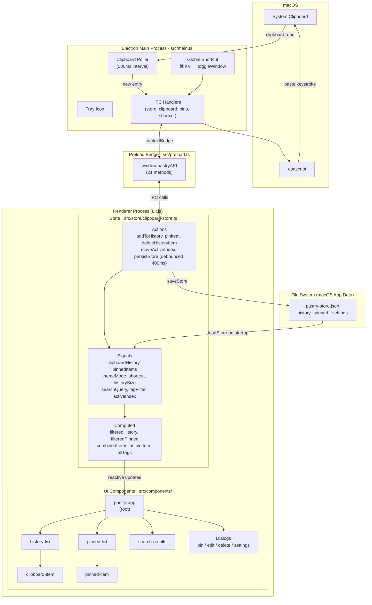

# Pastry

A macOS clipboard manager built with Electron, Lit.js, and avosignals.

## Features

- Rolling clipboard history (configurable size, default 20)
- Named pins — save any clipboard entry with a label
- Image clipboard support with thumbnails
- Search filters both history and pins simultaneously
- Edit pinned items (label and value)
- Keyboard navigation (↑↓ / Enter / ⌘C / Esc)
- Global shortcut **⌘⇧V** opens the panel from anywhere
- Persists history, pins, and settings across restarts

## Installing a release build

If you've been given access to this repository, you can download a pre-built app from the [Releases](../../releases) page — no Node.js or terminal needed.

1. Go to **Releases** (right sidebar on the repo page) and download the latest `.zip`
2. Extract the zip and drag `pastry.app` to your `/Applications` folder
3. **First launch — Gatekeeper:** because the app is not signed with an Apple developer certificate, macOS will block it with _"cannot be opened because the developer cannot be verified"_. To bypass this **once**, use either method:
   - **Option A (Finder):** Right-click (or Control-click) `pastry.app` → **Open** → click **Open** in the dialog
   - **Option B (System Settings):** Try to open the app normally; when blocked, go to **System Settings → Privacy & Security**, scroll down to the _"pastry was blocked"_ message, and click **Open Anyway**
   - You only need to do this on the very first launch
4. Grant **Accessibility access** when prompted (required for the Paste action):
   - Go to **System Settings → Privacy & Security → Accessibility**
   - Enable **pastry**

> **Note:** This repository is private. Only people added as collaborators can access the Releases page. If you can't reach the download link, ask to be added as a collaborator on GitHub.

## Publishing a new release

Releases are built and published automatically by GitHub Actions when you push a version tag:

```bash
git tag v1.0.1
git push origin v1.0.1
```

The action will build the app, sign it ad-hoc, and upload the `.zip` to the [Releases](../../releases) page. The tag name becomes the release name, so use [semantic versioning](https://semver.org) (e.g. `v1.0.0`, `v1.1.0`, `v1.2.3`).

To share the release with someone, add them as a collaborator on GitHub (**Settings → Collaborators → Add people**) and send them the Releases page link. They'll need a free GitHub account.

## Requirements

- macOS
- Node.js 18+
- npm 9+

## Setup

```bash
git clone git@github.com:anatolipr/pastry.git
cd pastry
npm install
```

## Running in development

```bash
npm start
```

The app will launch and register the **⌘⇧V** global shortcut. Press it from any app to open the Pastry panel.

> **First run:** macOS will ask you to grant Accessibility access to Pastry (required for the Paste action to send keystrokes to other apps). Go to **System Settings → Privacy & Security → Accessibility** and enable Pastry.

## Building a standalone app

```bash
npm run make
```

This produces a distributable `.app` bundle (and a `.zip`) in the `out/` directory. The `.app` can be copied to `/Applications` and run independently without Node.js or a terminal.

```
out/
  make/
    zip/darwin/arm64/
      pastry-darwin-arm64-1.0.0.zip   # distributable archive
  pastry-darwin-arm64/
    pastry.app                        # drag to /Applications
```

To package without creating an installer archive (faster, local use only):

```bash
npm run package
```

### macOS permissions for the standalone app

The Paste action uses `osascript` to switch focus and send keystrokes, which requires macOS permissions. Because the packaged app is unsigned, macOS will silently deny these without prompting. You need to ad-hoc sign the app after packaging:

```bash
npm run package
codesign --deep --force --sign - "out/pastry-darwin-arm64/pastry.app"
```

Then copy the app to `/Applications` and reset any previously denied permissions:

```bash
tccutil reset AppleEvents com.anatoli.pastry
tccutil reset Accessibility com.anatoli.pastry
```

Launch the app from Finder (not from terminal), trigger **⌘⇧V**, and click Paste — macOS will prompt:

1. **"pastry" wants access to control "System Events"** — click **Allow**
2. **Accessibility access** — open System Settings and enable Pastry under **Privacy & Security → Accessibility**

After granting both, Paste will work as expected.

## Keyboard shortcuts

| Key | Action |
|-----|--------|
| **⌘⇧V** | Open / close Pastry panel (global) |
| **↑ / ↓** | Navigate items |
| **Enter** | Paste selected item into previous app |
| **⌘C** | Copy selected item to clipboard |
| **Esc** | Close panel |

## Architecture



